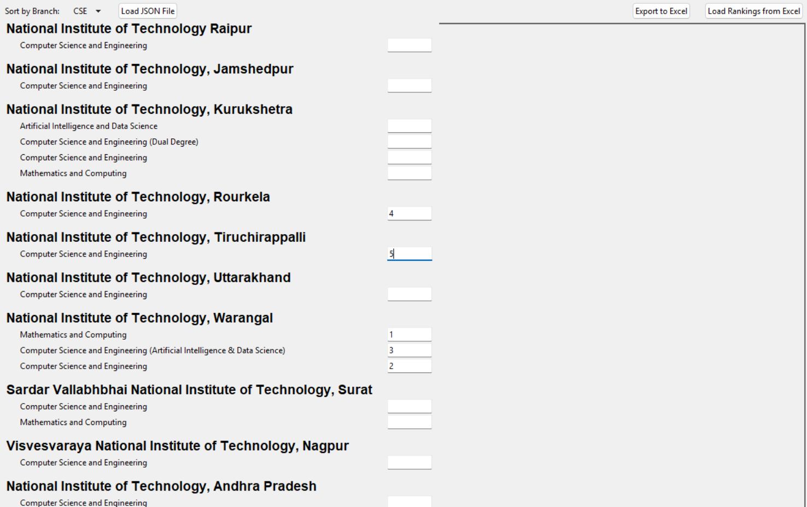

# 🎓 College Ranker GUI

A sleek and functional desktop GUI tool to rank colleges and branches **your way** — for students who want control over their own priorities.

---

## 💡 Features

- ✅ **Import JSON** college/branch data
- ✅ **Rank** each college-branch combo manually
- ✅ **Track & Edit** existing ranks anytime
- ✅ **Sort by Branch** using a dropdown
- ✅ **Filter View** dynamically
- ✅ **Export to Excel** with a single click
- ✅ **GUI updates live** as you interact

All packed in a minimal and user-friendly interface.

---

## 🖼️ Interface Preview



---

## 🚀 Getting Started

### 🔧 Requirements

- Python 3.10+
- `tkinter`, `pandas`

Install with:

```bash
pip install pandas
```

### ▶️ Run the App

```bash
python main.py
```

---

## 📂 Data Format (JSON)

The app uses a JSON file to load the college/branch data.

**Example:**

```json
{
  "National Institute of Technology, Tiruchirappalli": [
        "Electronics and Communication Engineering",
        "Computer Science and Engineering",
        "Mechanical Engineering",
        "Electrical and Electronics Engineering"
    ],
  "National Institute of Technology, Warangal": [
        "Electronics and Communication Engineering",
        "Mathematics and Computing",
        "Bio Technology",
        "Computer Science and Engineering (Artificial Intelligence & Data Science)",
        "Computer Science and Engineering",
        "Electrical and Electronics Engineering",
        "Electronics and Communication Engineering (VLSI Design and Technology)",
        "Mechanical Engineering"
    ],
  "National Institute of Technology Karnataka, Surathkal": [
        "Artificial Intelligence",
        "Computer Science and Engineering",
        "Electrical and Electronics Engineering",
        "Mechanical Engineering",
        "Information Technology",
        "Electronics and Communication Engineering",
        "Computational and Data Science"
    ]
}
```

---

## 🤖 Don’t Know How to Format Your Data?

No problem. You can ask an AI tool like **ChatGPT/Gemini/Grok/etc** to convert your list into the right JSON format.

Here’s a prompt to use follow it by pasting in the college and branch data:

> 💬 **Prompt:**
```
I have a list of colleges and their offered branches. Convert it into this JSON format:

{
  "College Name 1": ["Branch 1", "Branch 2", "Branch 3"],
  "College Name 2": ["Branch 1", "Branch 2"]
}

Make sure the output is clean and valid JSON.
```

Paste the AI’s output into a file that ends with the extension `.json`.

---

## 📤 Exporting

Once you’ve done ranking, click the **"Export to Excel"** button (top-right corner) to save your rankings into a `.xlsx` file automatically.

---

## ⚙️ Future Plans

- [ ] Add support for CSV input
- [ ] Include autosave and backup
- [ ] Support bulk editing via table view
- [ ] Dark Mode 😎

---

## 🧠 Built With

- Python + tkinter  
- pandas

---

## 🪪 Author

Made by **Mohammed Shaan**

## 🫶 Support

If you found this helpful, consider dropping a ⭐ or sharing it with your confused junior who doesn't know how to rank counseling choices 😌

---
